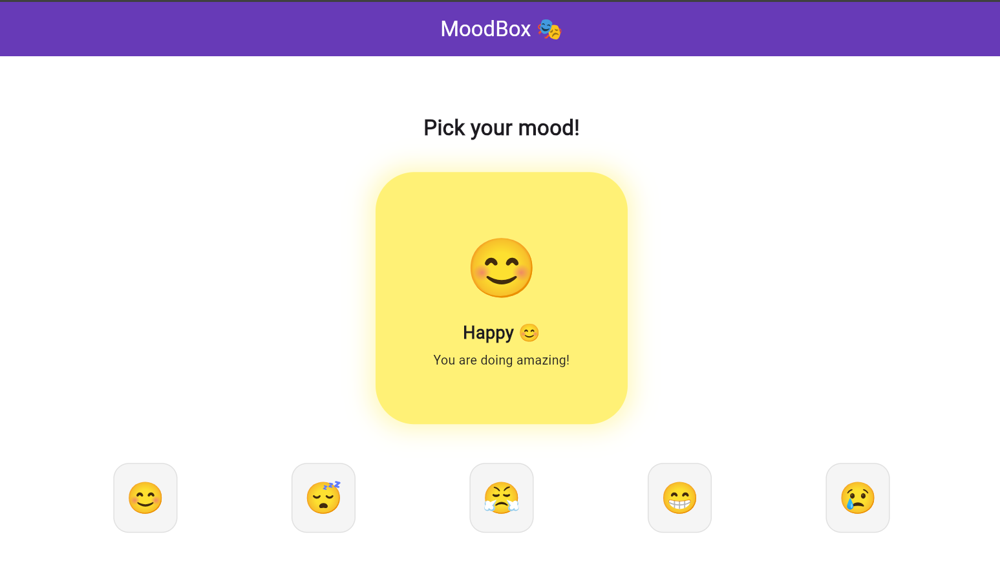

# MoodBox 🎭

A Flutter demo app that uses **AnimatedContainer** to visually respond to mood selections with smooth color, size, and shape transitions.

---

## 🚀 How to Run

1. Clone the repo: git clone https://github.com/IsimbiNelly/mood_box.git
2. Navigate into the folder: cd mood_box
3. Run the app: flutter run -d chrome (Or choose any other you'd like)
---

## 🎨 Widget: AnimatedContainer

`AnimatedContainer` works just like a regular `Container` but automatically animates between property changes — no extra animation controllers needed.

---

## ✨ Three Properties Demonstrated

### 1. `duration`
Controls how long the animation takes to complete.
- Short duration (100ms) = snappy and instant
- Long duration (2000ms) = slow and dramatic
- MoodBox uses **600ms** for a smooth, natural feel

### 2. `curve`
Controls the rhythm and style of the animation.
- `Curves.bounceOut` = playful bounce effect
- `Curves.linear` = mechanical, constant speed
- MoodBox uses **Curves.easeInOut** for a polished, natural transition

### 3. `color`
Sets the background color of the container. When the color value changes, `AnimatedContainer` smoothly interpolates between the old and new color automatically.
- 😊 Happy → Yellow
- 😴 Tired → Blue
- 😤 Stressed → Red
- 😁 Excited → Purple
- 😢 Sad → Grey

---

## 📸 Screenshot

---

## 👩‍💻 Author
Nelly Isimbi — African Leadership University